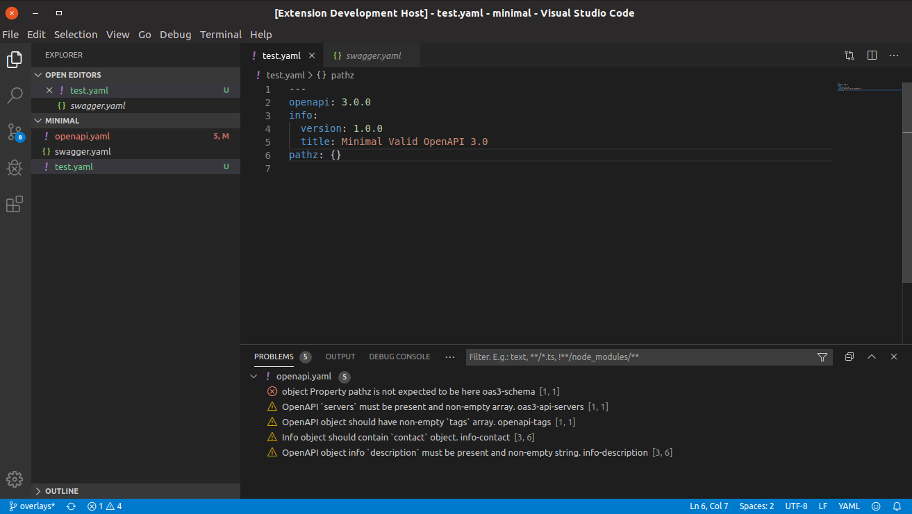

# Spectral Linter for VS Code

The Spectral VS Code Extension brings the power of [Spectral](https://stoplight.io/open-source/spectral?utm_source=github.com&utm_medium=referral&utm_campaign=github_repo_vs_code_spectral) to your favorite editor.

Spectral is a flexible object linter with out of the box support for [OpenAPI](https://openapis.org/) v2 and v3, JSON Schema, and AsyncAPI.

## Features

- Lint-on-save
- Lint-on-type
- Custom ruleset support (`.spectral.json`, `.spectral.yaml`, `.spectral.yml` or `.spectral.js`)
- Intellisense for custom ruleset editing
- Support for JSON and YAML input

## Requirements

- Node.js ^12.21 or >=14.13
- Visual Studio Code version 1.48 or higher.

## Installation

- Install from the [Visual Studio Code Marketplace](https://marketplace.visualstudio.com/items?itemName=stoplight.spectral)
- Install via the CLI: `code --install-extension stoplight.spectral`

## Extension Settings

This extension contributes the following settings:

- `spectral.enable`: Controls whether or not Spectral is enabled.
- `spectral.rulesetFile`: Location of the ruleset file to use when validating. If omitted, the default is a `.spectral.(json|yaml|yml)` in the same folder as the document being validated. Paths are relative to the workspace. This can also be a remote HTTP url.
- `spectral.run`: Run the linter on save (`onSave`) or as you type (`onType`).
- `spectral.validateFiles`: An array of file globs (e.g., `**/*.yaml`) which should be validated by Spectral. If language identifiers are also specified, the file must match both in order to be validated. You can also use negative file globs (e.g., `!**/package.json`) here to exclude files.
- `spectral.validateLanguages`: An array of language IDs (e.g., `yaml`, `json`) which should be validated by Spectral. If file globs are also specified, the file must match both in order to be validated.

## Thanks

- [Mike Ralphson](https://github.com/MikeRalphson)
- [Travis Illig](https://github.com/tillig)

## License

[Apache-2.0](LICENSE.txt)
